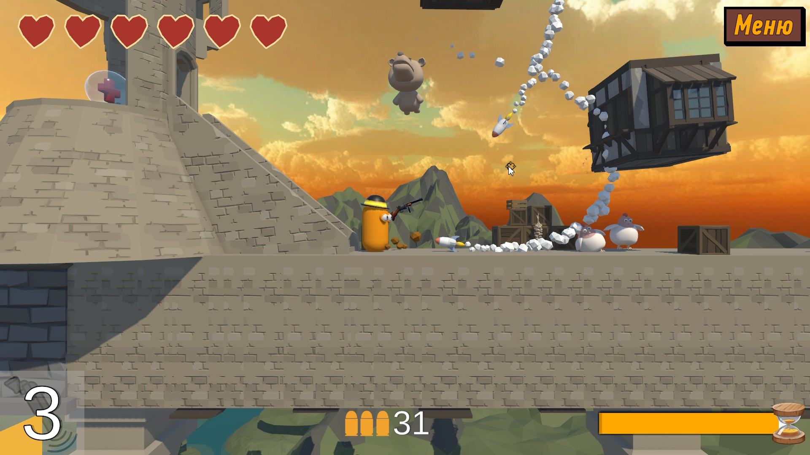

##About the project:

>___"Crazy Animals"___ is my pet project. It’s a platform game with one level. In this game I emphasized interaction with physics and level design.
  
>___Core mechanics:___ the player controls a capsule that can fly on a rope, shoot enemies and collect loot, the hero also has a couple of abilities that he can use, like as time dilation.

>___Interactions___ were created using physics. Also in the game there is a nice UI. All the effects of the game were created using the partiicle system

##Used plugins:

* Zenject

* MasterObjectPool2(MOP2)

* TextMeshPro (TMP)

* Universal Render Pipeline (URP)

* Adressables

* Cinemachine

##System requirements:

The project requires the Unity Environment 2022.8f1 or higher to work with it.

##Project installation:

To install the project, download it from GitHub and open it in Unity. Then, click on the "Play" button to start the project.

##Contribution to the project:

The project is open source, and we welcome contributions to its development. 
If you discover bugs or want to add new features, please submit a pull request to GitHub.

##Contacts:

If you have any questions or suggestions, please contact us through our GitHub or [Telegram](https://t.me/janitoor13).